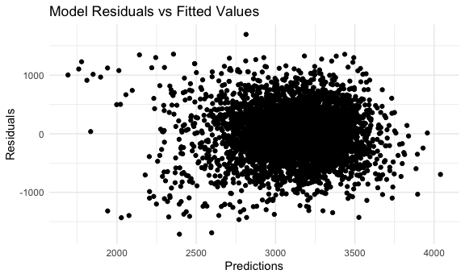
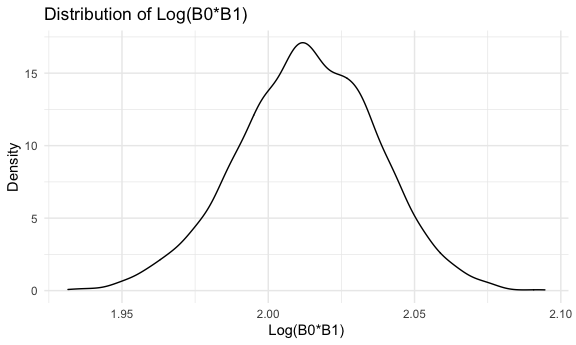

P8105: Homework 6
================
joseph Kim
12/3/2021

### Problem 1: Loading and Cleaning Datafile

``` r
birthweight_df = 
  read_csv("/Users/josephkim/Desktop/p8105_hw6_jhk2201/birthweight.csv") %>% 
  janitor::clean_names() %>% 
  mutate(babysex = recode(babysex, "2" = "Female", "1" = "Male"),
         babysex = factor(babysex, levels = c("Female", "Male")),
         frace = recode(frace,
           "1" = "White", 
           "2" = "Black",
           "3" = "Asian",
           "4" = "Puerto Rican",
           "8" = "Other",
           "9" = "Unknown"),
         frace = factor(frace, levels = c("White", "Black", "Asian", "Puerto Rican", "Other", "Unknown")), 
         malform = recode(malform, 
            "0" = "absent",
            "1" = "present"),
         malform = factor(malform, levels = c("absent", "present")),
         mrace = recode(mrace,
           "1" = "White", 
           "2" = "Black",
           "3" = "Asian",
           "4" = "Puerto Rican",
           "8" = "Other",
           "9" = "Unknown"),
         mrace = factor(mrace, levels = c("White", "Black", "Asian", "Puerto Rican", "Other", "Unknown")))
```

The birth weight data set presented 4342 rows of data for 20 different
variables. The categorical variables were changed to factor variables (4
variables).

------------------------------------------------------------------------

##### Part 2: Proposing the Model

Variables of Interest:

bwt: birth weight (outcome variables) smoken: average number of
cigarettes smoked per day during pregnancy mrace: mother’s race gaweeks:
gestational age in weeks momage: mother’s age at delivery (years)
wtgain: mother’s weight gain during pregnancy (pounds)

These variables were selected to see if we could predict a newborn’s
birth weight based on measurable data that based on the pregnant mother.

``` r
reg_birthweight = lm(bwt ~ smoken + mrace + gaweeks + momage + wtgain, data = birthweight_df)

reg_birthweight %>% 
  broom::tidy() %>% 
  knitr::kable(digits = 6)
```

| term              |    estimate | std.error |  statistic |  p.value |
|:------------------|------------:|----------:|-----------:|---------:|
| (Intercept)       |  833.744906 | 92.714950 |   8.992562 | 0.000000 |
| smoken            |  -11.229903 |  0.919887 | -12.207916 | 0.000000 |
| mraceBlack        | -276.631805 | 15.147057 | -18.263073 | 0.000000 |
| mraceAsian        | -191.174910 | 67.341914 |  -2.838870 | 0.004548 |
| mracePuerto Rican | -174.589636 | 29.745725 |  -5.869403 | 0.000000 |
| gaweeks           |   54.449077 |  2.153162 |  25.287958 | 0.000000 |
| momage            |    5.209449 |  1.838730 |   2.833177 | 0.004630 |
| wtgain            |    9.420824 |  0.612378 |  15.383990 | 0.000000 |

``` r
birthweight_df %>% 
  add_predictions(reg_birthweight) %>% 
  add_residuals(reg_birthweight) %>% 
  ggplot(aes(x = pred, y = resid)) + 
  geom_point()
```



Based off of the produced plots of the residuals, it appears as though
the points are distributed even above and below the zero line,
suggesting that the distribution is approximately normal.

------------------------------------------------------------------------

### Comparing Model using Cross Validated Predection

``` r
model1 = lm(bwt ~ blength + gaweeks, data = birthweight_df)

model2= lm(bwt ~ babysex * blength * bhead, data = birthweight_df)

model1 %>% 
  broom::tidy()
```

    ## # A tibble: 3 × 5
    ##   term        estimate std.error statistic  p.value
    ##   <chr>          <dbl>     <dbl>     <dbl>    <dbl>
    ## 1 (Intercept)  -4348.      98.0      -44.4 0       
    ## 2 blength        129.       1.99      64.6 0       
    ## 3 gaweeks         27.0      1.72      15.7 2.36e-54

``` r
model2 %>% 
  broom::tidy()
```

    ## # A tibble: 8 × 5
    ##   term                      estimate std.error statistic    p.value
    ##   <chr>                        <dbl>     <dbl>     <dbl>      <dbl>
    ## 1 (Intercept)                -802.    1102.       -0.728 0.467     
    ## 2 babysexMale               -6375.    1678.       -3.80  0.000147  
    ## 3 blength                     -21.6     23.4      -0.926 0.354     
    ## 4 bhead                       -16.6     34.1      -0.487 0.626     
    ## 5 babysexMale:blength         124.      35.1       3.52  0.000429  
    ## 6 babysexMale:bhead           198.      51.1       3.88  0.000105  
    ## 7 blength:bhead                 3.32     0.713     4.67  0.00000317
    ## 8 babysexMale:blength:bhead    -3.88     1.06     -3.67  0.000245

``` r
cv_df =
  crossv_mc(birthweight_df, 100) %>% 
  mutate(
    train = map(train, as_tibble),
    test = map(test, as_tibble)) %>% 
  mutate(
    proposed_model = map(train, ~lm(bwt ~ smoken + mrace + gaweeks + momage + wtgain, data = .x)),
    model_1 = map(train, ~lm(bwt ~ blength + gaweeks, data = .x)),
    model_2 = map(train, ~lm(bwt ~ babysex * blength * bhead, data = .x))) %>% 
  mutate(
    rmse_proposed_model = map2_dbl(proposed_model, test,  ~rmse(model = .x, data = .y)),
    rmse_model_1 = map2_dbl(model_1, test, ~rmse(model = .x, data = .y)),
    rmse_moddel_2 = map2_dbl(model_2, test, ~rmse(model = .x, data = .y)))
```

``` r
comparison_plot= 
  cv_df %>% 
  select(starts_with("rmse")) %>% 
  pivot_longer(
    everything(),
    names_to = "model", 
    values_to = "rmse",
    names_prefix = "rmse_") %>% 
  mutate(model = fct_inorder(model)) %>% 
  ggplot(aes(x = model, y = rmse)) + geom_violin() +
  labs( 
    x = "Model", 
    Y = "RMSE value", 
    title = "Model Comparison Plot")

comparison_plot
```


The resulting plot compares the RMSE of the three models presented. The
proposed model was the weakest predictive model of the three, as it had
the highest rmse value. Model 2 was the best, probably due to inclusion
of interactions.

------------------------------------------------------------------------

### Problem 2:

##### Code from Assignment to import weather data

``` r
weather_df = 
  rnoaa::meteo_pull_monitors(
    c("USW00094728"),
    var = c("PRCP", "TMIN", "TMAX"), 
    date_min = "2017-01-01",
    date_max = "2017-12-31") %>%
  mutate(
    name = recode(id, USW00094728 = "CentralPark_NY"),
    tmin = tmin / 10,
    tmax = tmax / 10) %>%
  select(name, id, everything())
```

The weather dataframe from the provide code produces 365 rows of data
with 6 variables.

##### R-squared

``` r
set.seed(1)

r_squared = 
  weather_df %>% 
  modelr::bootstrap(n = 5000) %>% 
  mutate(
    models = map(strap, ~lm(tmax ~ tmin, data = .x)),
    results = map(models, broom::glance)) %>% 
  select(-strap, -models) %>% 
  unnest(results) 

r_squared %>% 
  ggplot(aes(x=r.squared)) + geom_density()
```


The produced density shows that the distribution of r squared appears
approximately normal.

``` r
r_squared %>% 
  summarize(
    ci_lower = quantile(r.squared, 0.025), 
    ci_upper = quantile(r.squared, 0.975))
```

    ## # A tibble: 1 × 2
    ##   ci_lower ci_upper
    ##      <dbl>    <dbl>
    ## 1    0.894    0.927

The 95% confidence interval of the r-squared values is \[0.894, 0.927\]

##### Log(B0\*B1)

``` r
log_distribution = 
  weather_df %>% 
  modelr::bootstrap(n = 5000) %>% 
  mutate(
    models = map(strap, ~lm(tmax ~ tmin, data = .x)),
    results = map(models, broom::tidy)) %>% 
  select(-strap, -models) %>% 
  unnest(results) %>% 
  select(.id, term, estimate) %>% 
  pivot_wider(
    names_from = term, 
    values_from = estimate) %>% 
  rename(intercept = "(Intercept)") %>% 
  mutate(log_beta = log(intercept*tmin))  


log_distribution %>% 
  ggplot(aes(x=log_beta)) + geom_density()
```



Similarly to the distribution of r-squared values, the distribution of
the log(B0\*B1) is approximately normal.

``` r
log_distribution %>% 
    summarize(
    ci_lower = quantile(log_beta, 0.025), 
    ci_upper = quantile(log_beta, 0.975))
```

    ## # A tibble: 1 × 2
    ##   ci_lower ci_upper
    ##      <dbl>    <dbl>
    ## 1     1.96     2.06

The 95% confidence interval of log(B0\*B1) is \[1.97, 2.06\]
